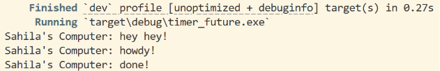

## Experiment 1.2: Understanding how it works

### Output

### Explanation
`hey hey!` muncul sebelum `howdy!` meskipun baris `println!("hey hey!")` ditulis setelah `spawner.spawn(...)` di kode.

Ini terjadi karena `spawner.spawn(...)` hanya mengantrikan task, tidak langsung menjalankan async block di dalamnya. Eksekusi async block baru benar-benar terjadi ketika `executor.run()` dipanggil.

Jadi urutan eksekusinya adalah:
1. `spawner.spawn(...)` -> task didaftarkan ke queue (belum dijalankan)
2. `println!("hey hey!")` -> langsung dieksekusi (kode synchronous biasa)
3. `drop(spawner)` -> spawner ditutup
4. `executor.run()` -> async block dijalankan:
   - print `howdy!`
   - tunggu 2 detik (TimerFuture)
   - print `done!`