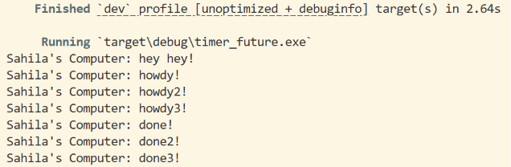
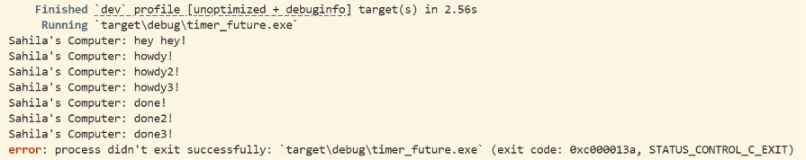

## Experiment 1.2: Understanding how it works

### Output

### Explanation
`hey hey!` muncul sebelum `howdy!` meskipun baris `println!("hey hey!")` ditulis setelah `spawner.spawn(...)` di kode.

Ini terjadi karena `spawner.spawn(...)` hanya mengantrikan task, tidak langsung menjalankan async block di dalamnya. Eksekusi async block baru benar-benar terjadi ketika `executor.run()` dipanggil.

Jadi urutan eksekusinya adalah:
1. `spawner.spawn(...)` -> task didaftarkan ke queue (belum dijalankan)
2. `println!("hey hey!")` -> langsung dieksekusi (kode synchronous biasa)
3. `drop(spawner)` -> spawner ditutup
4. `executor.run()` -> async block dijalankan:
   - print `howdy!`
   - tunggu 2 detik (TimerFuture)
   - print `done!`

## Experiment 1.3: Multiple Spawn and removing drop

### Output dengan Multiple Spawn

### Output setelah drop(spawner) dihapus

### Explanation

**Spawner** mengirim task ke dalam channel yang dibaca oleh Executor. **Executor** mengambil task dari channel dan menjalankannya (poll). **drop(spawner)** menutup sisi pengirim channel, sehingga Executor tahu bahwa tidak akan ada task baru lagi.

Dengan multiple spawn, ketiga task dijalankan secara concurrent oleh satu executor. Semua `howdy` muncul lebih dulu karena ketiga task langsung dieksekusi sampai titik `.await` (TimerFuture). Saat menunggu timer, executor beralih ke task berikutnya. Setelah ~2 detik, semua timer selesai dan ketiga `done` muncul hampir bersamaan.

Ketika `drop(spawner)` dihapus, channel pengirim tidak pernah ditutup. `executor.run()` menggunakan `ready_queue.recv()` yang akan block selamanya menunggu task baru yang tidak akan datang, sehingga program tidak bisa exit.